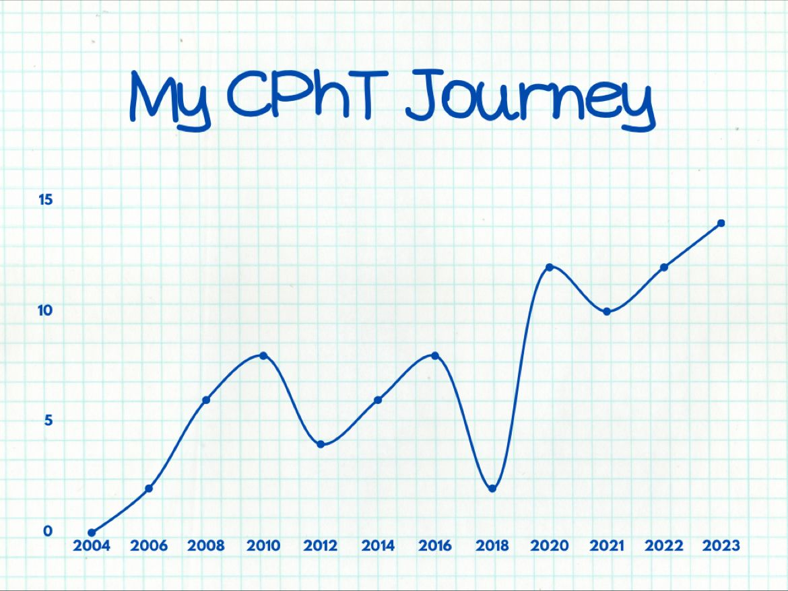

+++
title = 'About'
date = 2024-11-11T15:04:09-05:00
draft = false
+++

My name is Polo Heysquierdo and I am a CPhT.

This is it, this is story I’ve been trying to share. 

I’ll skip the early parts and get to the meat of what most who read this care about. There are lots of dips, and a lot of steep rises.

The dips were the low points obviously, but those were the times where I made big changes. Without those changes I don’t believe I would be where I am today. 

2010-2013 - I was done being just a tech, there’s was no growth in what I wanted to actually do. I knew what I wanted to do as a pharmacy professional, informatics. BUT technicians were not considered for these roles. I left a hospital of almost 10yrs to work at a new hospital and help break ground to learn Omnicell and Epic.

2016-2018 - This was a tough time Depression had set in hard. I had become an automation technician/lead tech. It was fun for bit, but I wanted more. Countless interviews with the CIS team for Epic positions, being turned down several times really got to me. So it was either stay and just be complacent with what I was doing or take chance on a new career, this time impacting my family. The plan was to double what I made and figure out how to get closer to working with Epic like I wanted. 

2019 - The beginning of 2019 was the start, I was interviewing again outside of what I was comfortable with. The idea was to network not land jobs, I knew I wouldn’t get hired as an analyst, but I figured if the end goal is to be an analyst, it’s better to know more analysts so when the chance did come up I had a network to help me. End of 2019 I left to work with Omnicell not knowing the whole world would be greeting with a litttle thing called Covid. 

2020 - Covid is in full effect, but I hit my stride with Omnicell. Things were great, I was extremely happy, saw lots of places, learned so much more about myself and how to focus on skills and NETWORK. The ability to meet new people and expand my contacts as I met more analysts and people within the Omnicell organization really opened my eyes to other opportunities. 

2021 - The plan at this point was to be remote with Omnicell. I was making the salary I wanted, I liked traveling, but leaving my wife at home with two kids every week while she worked and managed everything while I was on the road was wearing on me. So back to applying and interviewing. 

End of 2021- I caught a break, a Willow position, a team looking for a pharmacy technician who wanted to be certified and had Omnicell experience. This is the position I had wanted, but I had just gotten a promotion with Omnicell, I was at a crossroad, stay with a company that I knew had stable growth and a for sure future or leave it all and chase the dream? 

If you read my job description you know the outcome of that decision. 

If you made it this far I hope this helps, I hope this makes sense to many technicians who were and are in the same situation. 

Follow me on my Socials (the swet icons on the mhome page) you'll get a peak of my personality, my likes, my dislikes, memes and rage quits. Connect with me on LinkedIn for the same, but I try to make it seem more professional.

TLDR: Keep grinding, you only need one chance. 

Update in 2024: 
Nov 2024, I have started with Adventist Health in a Willow role to be part of an Epic Implementation. Follow me along for this next ride!

